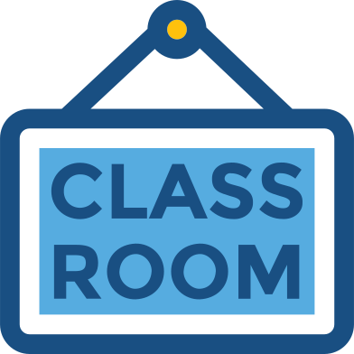

####  Online classroom

#### Course website:  
[https://nbisweden.github.io/workshop-neural-nets-and-deep-learning/](index)
 

#### Schedule with links to lectures and exercises:  
[https://nbisweden.github.io/workshop-neural-nets-and-deep-learning/schedule](schedule)
 

#### The Zoom Main room:
*The link to the zoom room is pinned in the student slack channel (see below)*
- lectures
- questions during exercises
- Zoom breakout rooms will be used for discussions in smaller groups
 

#### Student slack channel  
[https://nbisweden.slack.com/app_redirect?channel=nn_dl_students](https://nbisweden.slack.com/app_redirect?channel=nn_dl_students)
- questions during lectures or exercises
 

#### HackMD:
*The link to the HackMD page room is pinned in the student slack channel (see above)*
- *Important information* on how to setting up your laptop for the course.
- working area for exercises, communication, etc.
 

#### Practical issues
- Try to keep your **cameras on**, but **microphone muted**
- Lectures with many breaks
- Take lots of small breaks also when working with the exercises
- We will try to stick to the schedule, but it's only preliminary
until it's happened
- If you have any questions during the lecture, feel free to unmute
 and ask. If you don't want to ask in the Zoom meeting, write the
  question in the chat or on slack
