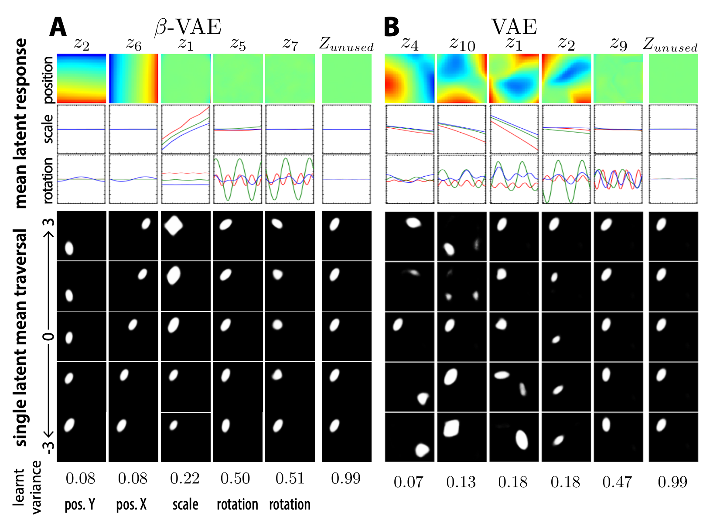
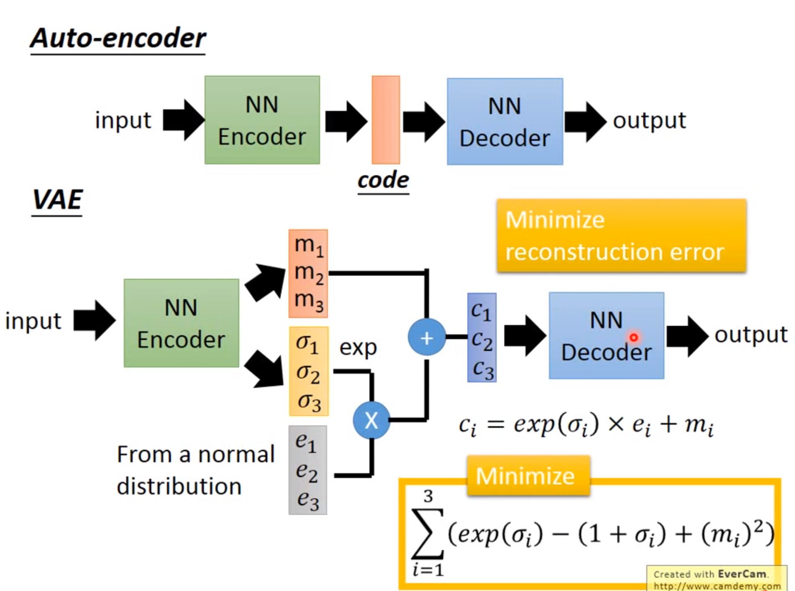

exclude: true
count: false

```{r,echo=FALSE,child="assets/header-presentation.Rmd"}
```

<!-- ------------ Only edit title, subtitle & author above this ------------ -->

```{r,echo=FALSE,message=FALSE,warning=FALSE}
# load the packages you need
#library(dplyr)
#library(tidyr)
#library(stringr)
#library(ggplot2)
library(emo)
```

---
name: topic1

## If you need, `Keras` and `TensorFlow` in R

* you need TensorFlow first,
--

* than, you also need the `tensorflow` [package](https://tensorflow.rstudio.com/installation/)...

--
* good `r emo::ji('happy')` news is you do not need to install manually...

--
* install `keras` package instead.

--
```{r, eval=FALSE}
install.packages('keras')
keras::install_keras()
```

--
* if your graphics card supports CUDA and you want to use the power of GPU. 
```{r, eval=FALSE}
install.packages('keras')
keras::install_keras(tensorflow = 'gpu')
```

--
* at least two packages provide R interfaces to `Keras`: `keras` by RStudio and `kerasR`. The latter does not expose all Keras functionalities to R though. 

---
name: topic2

## R `r emo::ji('heart')` Keras & TensorFlow

There are excellent resources for learning:

* about TensorFlow [package](https://tensorflow.rstudio.com/guide/tensorflow/eager_execution/) from RStudio,

--
* excellent book by Chollet & Allaire
.size-20[]

--
* RStudio Deep Learning with Keras [cheatsheet](https://github.com/rstudio/cheatsheets/raw/master/keras.pdf)
.size-20[]

--
* from [keras.rstudio.com](https://keras.rstudio.com)

---
name: neural_zoo
# Neural `r emo::ji('brain')` Zoo `r emo::ji('camel')` `r emo::ji('squirrel')` `r emo::ji('zebra')` `r emo::ji('dolphin')`

.pull-left-50[
.size-70[]
.small[source: [Asimov Institute](https://www.asimovinstitute.org/neural-network-zoo/)]
]
.pull-right-50[
An autoencoder is "just" a specific ANN architecture:  
.size-35[]
.small[source: [Asimov Institute](https://www.asimovinstitute.org/neural-network-zoo/)]
]

---
name: autoencoders2
# Autoencoders 
So, what is really happening here`r emo::ji('question')`

--
* output data (`r emo::ji('target')`) are THE SAME as the input data (not always, but a good assumption for now),

--
* it is thus called **semi-supervised learning** (sometimes **self-supervised**),

--
* the **loss function** favors weight sets that are able to reconstruct the data from itself `r emo::ji('recycle')`,

--
* why do we want a network that can reconstruct input data? A waste `r emo::ji('trash')` of resources?

--
* not really! What we want is the `r emo::ji('champagne')`.

.pull-left-50[
.size-70[]
.small[source: [Wikimedia Commons](assets/autoencoder_schema.png)]
]

---
name: applications_compression
# Applications: compression
.size-90[]
.small[source: [sefix.com](https://sefiks.com/2018/03/21/autoencoder-neural-networks-for-unsupervised-learning/)]

---
name: denoising_autoenc
# Applications: denoising

---
name: denoising_autoenc
# Applications: neural inprinting

---
name: semantic_vae
# Applications: semantic segmentation
.pull-left-50[
    
]
.pull-right-50[

]

---
name: ae_discontinuity
# Bad, bad, ugly latent space `r emo::ji('shit')`
.size-60[]
.small[source: [Irhum Shafkat](https://towardsdatascience.com/intuitively-understanding-variational-autoencoders-1bfe67eb5daf)]

---
name: ae_vs_vae
# AE vs. VAE latent space


---
name: vae1
# Variational AutoEncoder (VAE)
.pull-left-50[
.small[
source: [Irhum Shafkat](https://towardsdatascience.com/intuitively-understanding-variational-autoencoders-1bfe67eb5daf)
]
]

---
name: vae2
# Variational AutoEncoder (VAE)
.pull-left-50[]
.pull-right-50[]
.small[source: [Irhum Shafkat](https://towardsdatascience.com/intuitively-understanding-variational-autoencoders-1bfe67eb5daf)]

---
name: desired_latent_space
# Towards latent space we want
.size-60[]

---
name: reparametrization_trick
# The reparametrization trick `r emo::ji('tophat')``r emo::ji('rabbit')`
  

.small[source: [antkillerfarm](http://antkillerfarm.github.io/images/img2/VAE_13.png)]

---
name: vae2
# Loss function
$\mathcal{L}(\Theta, \phi; \bar{x}, \bar{z}) = \mathbb{E}_{q_{\phi}(\bar{z}|\bar{x})}[\log{p_{\phi}}(\bar{x}|\bar{z})]$
.size-80[]

--
We need some `r emo::ji('policeman')` `r emo::ji('policeman')`!  

---
name: kl_div
# Kullback-Leibler divergence
Officers Solomon Kullback and Richard Leibler `r emo::ji('oncoming_police_car')`!  
--


--

> NOTE! $D_KL(P|Q) \neq D_KL(Q|P)$ and that is why it is a divergence, not a distance.

---
name: KL_in_R
# Kullback-Leibler in R

$D_{KL} = P(x) \times \log{\left(\frac{P(x)}{Q(x)}\right)}$

```{r}
KL_div <- function(mu1 = 0, sigma1 = 1, mu2, sigma2) {
  g <- function(x) {
    P <- dnorm(x, mean=mu1, sd=sigma1, log=F)
    logP <- dnorm(x, mean=mu1, sd=sigma1, log=T)
    logQ <- dnorm(x, mean=mu2, sd=sigma2, log=T)
    val <- P * (logP - logQ)
    return(val)
  }
  result <- integrate(g, -Inf, Inf)
  return(result$value)   
} 

KL_div(mu1 = 0, sigma1 = 1, mu2 = 0, sigma2 = 1)
KL_div(mu1 = 0, sigma1 = 1, mu2 = 0, sigma2 = 2)
KL_div(mu1 = 0, sigma1 = 1, mu2 = 1, sigma2 = 1)
```

---
name: KL_only_loss
# What if we only use $\mathcal{D}_{KL}$?  
$\mathcal{L}(\Theta, \phi; \bar{x}, \bar{z}) =  \mathcal{D}_{KL}(q_{\phi}(\bar{z}|\bar{x})||p(\bar{z}))$  
The `r emo::ji('church')` `r emo::ji('man_student')` Bayesian connection...

--
.size-50[]

---
name: vae_full_loss_fn
# Complete loss function
$\mathcal{L}(\Theta, \phi; \bar{x}, \bar{z}) = \mathbb{E}_{q_{\phi}(\bar{z}|\bar{x})}[\log{p_{\phi}}(\bar{x}|\bar{z})] - \mathcal{D}_{KL}(q_{\phi}(\bar{z}|\bar{x})||p(\bar{z}))$
.size-60[]

---
name: beta-vae
# $\beta$-VAEs
We can make neurons in the latent layer (bottleneck) **disentangled**, i.e., force that they learn different generative parameters:

$\mathcal{L}(\Theta, \phi; \bar{x}, \bar{z}) = \mathbb{E}_{q_{\phi}(\bar{z}|\bar{x})}[\log{p_{\phi}}(\bar{x}|\bar{z})] - \mathbf{\beta} \times \mathcal{D}_{KL}(q_{\phi}(\bar{z}|\bar{x})||p(\bar{z}))$


Image after: [β-VAE: Learning Basic Visual Concepts with a Constrained Variational Framework, Higgins et al., ICLR, 2017](https://openreview.net/pdf?id=Sy2fzU9gl)
  
Further reading: [Understanding disentangling in β-VAE, Burgess et al., 2018](https://arxiv.org/abs/1804.03599)

---
name: beta_vae_ex2
# $\beta$-VAEs
.size-70[]
.small[Source: [β-VAE: Learning Basic Visual Concepts with a Constrained Variational Framework, Higgins et al., ICLR, 2017](https://openreview.net/pdf?id=Sy2fzU9gl)]
---
name: ae_vae_summary1
# Summary
.size-70[]
.small[source: [iart.ai](http://iart.ai)]
---
name: ae_vae_summary2
# Summary

* Autoencoders (AE) -- specific ANN architecture.
* Autoencoders: 
    + non-generative
    + $\mathcal{L}$ minimizes reconstruction loss
    + latent space is discontinuous and has "gaps"
    + good enough for great many applications
* Variational Autoencoders:
    + generative
    + $\mathcal{L}$ minimizes reconstruction loss and **latent loss**
    + latent space has no gaps and is continuous
    + contain stochastic node -- need a reparametrization trick
    + still, the distributions are entangled and have no obvious meaning
* $\beta$-VAEs (disentangled VAEs):
    + same as VAEs but the distributions have interpretation.

<!-- --------------------- Do not edit this and below --------------------- -->

---
name: end_slide
class: end-slide, middle
count: false

# Let's build some autoencoders!

```{r,echo=FALSE,child="assets/footer-presentation.Rmd"}
```

```{r,include=FALSE,eval=FALSE}
# manually run this to render this document to HTML
rmarkdown::render("presentation_demo.Rmd")
# manually run this to convert HTML to PDF
#pagedown::chrome_print("presentation_demo.html",output="presentation_demo.pdf")
```
